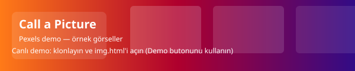

# Call a Picture — Animasyonlu Görsel Arama (Pexels)

> Basit, öğretici ve görsel odaklı bir Pexels arama uygulaması. Bir arama terimi girip sonuçları sayfada görebileceğiniz küçük bir HTML uygulaması.




Özellikle yeni başlayanlar için: API çağrısı yapma, CORS/ön uç proxy sorunlarıyla baş etme ve sonuçları DOM'a yerleştirme adımlarını gösterir.

## Öne çıkan özellikler
- Pexels API ile arama (örnek kullanım).
- Basit, tek dosyalık HTML + JS yapısı: kolayca klonlayıp çalıştırılabilir.
- Hızlı görsel önizleme (thumbnail).
- Öğretici amaçlı; geliştirilmeye açık.

## Demo (Animasyonlu)
Projeye bir `assets/demo.svg` veya `assets/demo.mp4` ekledim; repo içindeki SVG animasyon canlı bir önizleme sağlar.

## Nasıl çalıştırılır (en kısa yol)
1. Depoyu klonlayın:
   git clone https://github.com/AliBasboga/call-a-picture.git
2. Proje dizinine girin:
   cd call-a-picture
3. Basit bir statik sunucu çalıştırın (örnek: Python):
   python3 -m http.server 8000
4. Tarayıcıda açın:
   http://localhost:8000/call%20a%20picture/img.html

Alternatif (Node.js):
- npm install -g http-server
- http-server -c-1
- http://localhost:8080/call%20a%20picture/img.html

> Not: Tarayıcınızdan doğrudan `file://` ile açmak bazı CORS/sunucu davranışlarını değiştirebilir. Her zaman küçük bir sunucu kullanmak en güvenlisidir.

## Kullanım
1. Arama kutusuna bir kelime yazın (ör. "mountains").
2. Search butonuna basın.
3. Sonuçlar sayfada gösterilecektir. Eğer API anahtarınız yoksa "Demo" butonuna basarak örnek görselleri görebilirsiniz.

## Önemli — API anahtarı ve CORS
- Depoda artık gömülü bir Pexels API anahtarı yok. `call a picture/img.html` içinde `apiKey` değişkenini kendi anahtarınızla veya bir sunucu tarafı endpoint ile beslemeniz gerekiyor.
- Üretimde API çağrılarını doğrudan tarayıcıdan yapmamak, bunun yerine sunucu tarafı proxy veya backend endpoint kullanmak daha güvenlidir.
- Mevcut kodda örnek bir CORS proxy olarak `https://cors-anywhere.herokuapp.com/` kullanılmıştır. Bu servis herkese açık değildir; kendi sunucunuzu kullanmanız önerilir.

Önerilen güvenli akış:
- Sunucuda küçük bir endpoint oluşturun: /api/search?q=...
- Sunucu Pexels'e istek yapar ve tarayıcıya döner.
- Böylece API anahtarınız sunucuda gizli kalır.

## Dosya yapısı (mevcut)
```
call a picture/
  img.html        # Basit HTML + JS ile Pexels arama örneği (güncellendi)
assets/           # demo SVG animasyonu eklendi
README.md
```

Öneri: Klasör adındaki boşluklar URL ve script yönetimini zorlaştırabilir. `call-a-picture/` gibi tirele ayrılmış bir klasör adı daha rahat çalışır.

## İyileştirme fikirleri (hızlı)
- API anahtarını çevre değişkenleriyle yönetilecek bir backend endpoint'e taşı.
- Lazy-loading ve grid görünümü ekle (CSS Grid veya Masonry).
- Görselleri tıklayınca tam boy gösteren bir modal ekle. (img.html'de örnek modal eklendi)
- Daha fazla sonuç yüklemek için "Load more" veya sonsuz kaydırma.
- Responsive stil ve küçük ekran optimizasyonu (mobil).

## Katkıda bulunma
1. Fork yapın.
2. Yeni özellik ekleyin veya README'yi geliştirin.
3. Pull request açın: yapılan değişikliklerin neden yararlı olduğunu kısa açıklayın.

## Lisans
Bu projeyi açık kaynak geliştirmeniz için MIT lisansı altında öneriyorum — isterseniz README'ye bir LICENSE dosyası ekleyebilirim.

---

Repoya README, bir demo SVG ve güncellenmiş img.html dosyasını ekledim. Eğer isterseniz README'yi İngilizceye çevirebilirim veya assets içine gerçek bir GIF eklemekte yardımcı olabilirim.